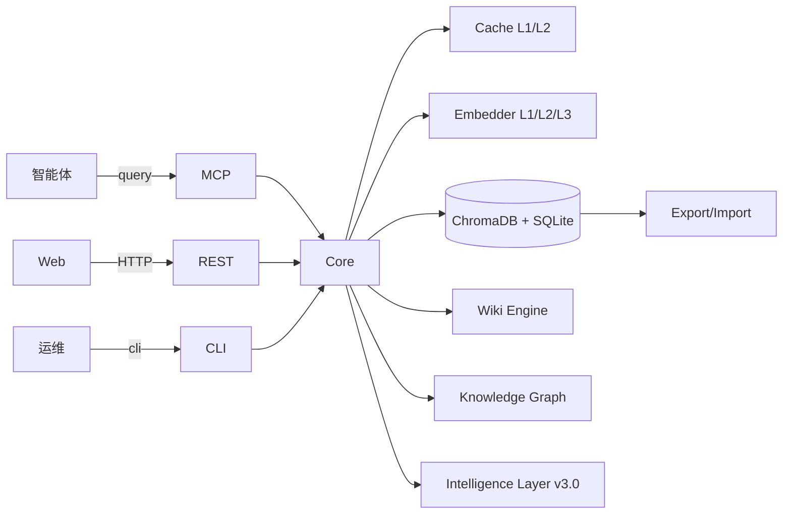

# 架构总览

盘古是一个面向「智能体大脑」设计的 **4 层记忆系统**，使用「宫殿」结构组织记忆，共 **94 个模块**。

## 1. 4 层记忆栈（Memory Stack）

| 层 | 名称 | 容量 | 触发时机 | 目标延迟 |
|:---:|:---|:---:|:---|:---:|
| **L0** | 身份层（Identity）| KB 级 | 启动时载入 | < 1 ms |
| **L1** | 摘要层（Summary）| 15 drawers | 每次对话结束 | < 5 ms |
| **L2** | 按需层（On-demand）| 1000+ drawers | query 触发 | < 50 ms |
| **L3** | 深度检索层（Deep Search）| 1 M+ | 显式调用 | < 200 ms |

```
┌───────────────────────────────────────────────┐
│ L0 Identity │  I am 盘古 …                    │   永远在
├───────────────────────────────────────────────┤
│ L1 Summary  │  最近 3 段对话摘要                  │   每次注入
├───────────────────────────────────────────────┤
│ L2 On-demand│  query 命中的 10 条原文             │   按需
├───────────────────────────────────────────────┤
│ L3 Deep     │  全文 / 语义 / 混合检索              │   显式
└───────────────────────────────────────────────┘
```

## 2. 宫殿结构（Palace Memory）

- **Wing（空间）** — 一类主题的所有记忆
- **Room（页）** — 时间或任务窗口
- **Drawer（抽屉）** — 单条记忆片段（最小单元）
- **Hall（大厅）** — 当前焦点记忆的集合
- **Tunnel（隧道）** — 跨时间跨主题的关联通道

## 3. 3 级退化嵌入

```
请求嵌入
   ↓
1. 外部 LLM API  ← 优先（Ollama / OpenAI / vLLM）
   ↓ 失败 3 次
2. ONNX 本地推理 ← Xenova/all-MiniLM-L6-v2（dim 384，~12ms/text）
   ↓ 模型未就绪
3. Hash 向量     ← blake2b → 384 维 0/1 向量（保底）
```

带熔断器：连续 5 次失败 → 60s 内只走降级；恢复后自动试探。

## 4. 2 级 LLM 响应缓存

```
LLM 调用
   ↓
1. 内存 LRU  ← 128 条，O(1)
   ↓ miss
2. SQLite 持久化 ← 100MB 上限，TTL 7 天，hit_count 持久化
   ↓ miss
3. 真实 LLM 请求
```

- 启动可启用「预热」：将一组固定 prompt 提前写满缓存
- 周期 VACUUM 释放磁盘碎片

## 5. 知识图谱（Knowledge Graph）

- 11 种内置关系：causes / contradicts / refines / depends_on / related_to / temporal / enables / hinders / supersedes / wikilink / mentions
- 三元组存储：`(subject, predicate, object, confidence, evidence)`
- 双向游走：从任意实体出发可 2 跳内抵达 80% 关系

## 6. v3.0 智能层（Intelligence Layer）

v3.0 新增智能层，提供以下能力：

- **项目管理** — 多项目隔离、项目级记忆与任务管理
- **审计分析** — 操作日志、访问统计、异常检测
- **记忆质量评估** — 自动检测重复/过时/低质量记忆
- **全量导出/备份** — 支持 JSONL 格式导出与一键备份恢复
- **跨节点同步** — 支持多实例间记忆同步

## 7. 四个暴露面

| 面 | 协议 | 用途 |
|:---|:---|:---|
| **MCP** | JSON-RPC over stdio/HTTP | 智能体（Claude Desktop / 自研）|
| **REST** | FastAPI / uvicorn | Web / 监控 / 第三方 |
| **CLI** | typer | 运维 / 调试 / 一次性任务 |
| **Sync** | gRPC / WebSocket | 跨节点同步 |

## 8. 数据流



## 9. 关键不变量

- **因果一致性**：写入顺序与意图一致
- **幂等**：Drawer 有 `(id, version)` 唯一键，重复写入被去重
- **可恢复**：checkpoint 文件 + SQLite WAL，单进程崩溃不丢数据
- **可观测**：所有慢操作 (> 100ms) 写入结构化日志
